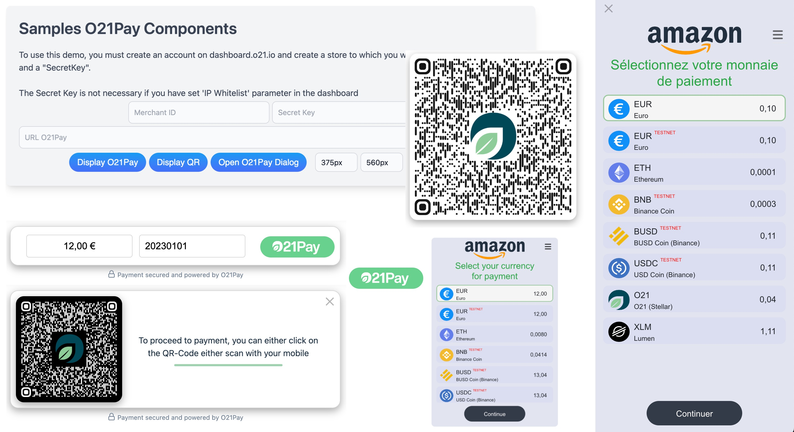
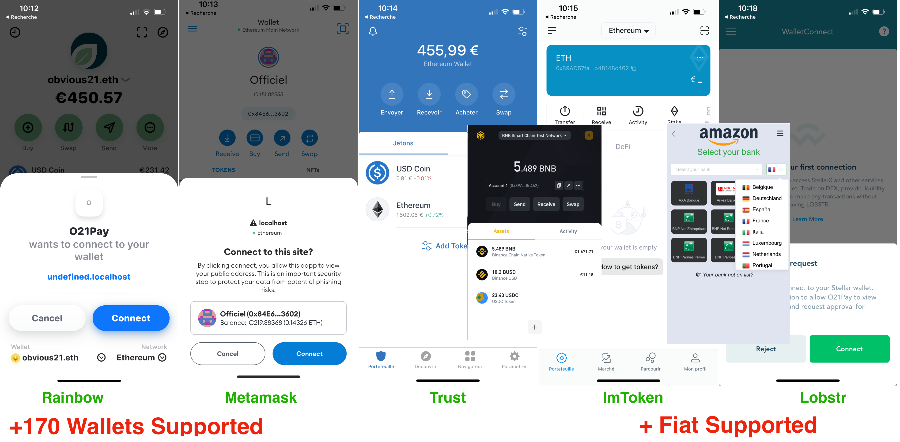

<div align="center">
<picture>
  
</picture>
<br/><br/>

### O21Pay-Components, Simple, Fast Payment.

<br/>

[](https://www.npmjs.com/package/o21pay-components)
[](https://github.com/prettier/prettier)


</div>
<br/>
O21Pay-Components is a simple library for building fast, lightweight web payments components (Fiat + Cryptos).

At O21Pay-Components is a boilerplate-killing component base class that provides ....

<p align="center">
  
  <br/>
  <br/><br/>
  
</p>

## Getting Started

-   Read about [O21Pay](https://github.com/obvious21/o21pay)

## Installation

To install from npm:

```sh
npm i
```

If you do not want to install all the modules mandatory for 021Pay you must use this script in your html file

```
<script type="module" src="https://cdn.jsdelivr.net/npm/o21pay-components@latest/dist/all.js"></script>
```

To install optimized version from npm:

```sh
npm i
npm i o21pay-components@latest --save
```

If you want to use an optimal version of 021Pay you must use this script in your html file, but in this case you will have to install the missing modules manually in npm

```
<script type="module" src="https://cdn.jsdelivr.net/npm/o21pay-components/dist/all.min.js"></script>
```

To run demo:

```sh
vite

VITE v3.2.1  ready in 220 ms

  ➜  Local:   http://localhost:5173/
  ➜  Network: use --host to expose
```

## o21pay-payments

Display/Allows access to payment

-   Methods

    -   init(amount, order_ref)

-   Attributs

    | Name             | Description                   | Mandatory |
    | ---------------- | ----------------------------- | :-------: |
    | merchant_id      | Merchant ID                   |     Y     |
    | secretkey        | Secret key (only for Testing) |     N     |
    | form             | Form or Button                |     N     |
    | readonly         | Readonly (only Form)          |     N     |
    | disabled         | Disabled (only Form)          |     N     |
    | amount           | Amount of payment             |     N     |
    | order_ref        | Your Order Reference          |     N     |
    | hidden_order_ref | Hidden Order Reference        |     N     |
    | suggestion       | List of amount: "10,50,100"   |     N     |

-   Events

    | Name                   | Description                                          |
    | ---------------------- | ---------------------------------------------------- |
    | o21pay_payment_request | Each time you receive a new url                      |
    | o21pay_QRclick         | You receive this event when you click on the qr-code |

-   Example

```html
<o21pay-payment merchant_id="xxxx" amount="20" order_ref="1234556789" form readonly></o21pay-payment>
```

```javascript
addEventListener('o21pay_payment_request', function (e) {
    //e.detail.url;
})

addEventListener('o21pay_QRclick', function (e) {
    //e.detail.url;
})
```

## o21pay-qr

Display QR-Code

-   Attributs

    | Name   | Description            | Mandatory |
    | ------ | ---------------------- | :-------: |
    | size   | width/hight of QR-Code |     N     |
    | theme  | light/dark             |     N     |
    | shadow | Display shadow window  |     N     |

-   Events

    | Name           | Description                                          |
    | -------------- | ---------------------------------------------------- |
    | o21pay_QRclick | You receive this event when you click on the qr-code |

-   Example

```html
<o21pay-qr size="320" theme="light" shadow></o21pay-qr>
```

```javascript
addEventListener('o21pay_QRclick', function (e) {
    //e.detail.url;
})
```

## o21pay-dialog

Display process payment from url payment

-   Methods

    -   init(url, width, height, mode)
        -   url: [mandatory] url payment
        -   width: [Optional] width of window
        -   height: [Optional] height of window
        -   mode: [Optional] mode display (dialog, drawer-left, drawer-right, fullscreen)

-   Properties

    | Name   | Description     |
    | ------ | --------------- |
    | events | events callback |

-   Attributs

    | Name   | Description                                                  | Mandatory |
    | ------ | ------------------------------------------------------------ | :-------: |
    | url    | url payment                                                  |     Y     |
    | width  | width of window)                                             |     N     |
    | height | height of window                                             |     N     |
    | mode   | Display mode (dialog, drawer-left, drawer-right, fullscreen) |     N     |

-   Events

    List of messages that you can receive:

    | Name                     | Description               |
    | ------------------------ | ------------------------- |
    | o21pay_mounted           | Window Payment is mounted |
    | o21pay_ready             | Window Payment is ready)  |
    | o21pay_closed            | Window Payment is closed  |
    | o21pay_payment_success   | Successful payment        |
    | o21pay_payment_cancelled | Payment cancel            |
    | o21pay_payment_error     | Payment in error          |

-   Example

```html
<o21pay-dialog url="" width="420px" height="560px" mode="dialog"></o21pay-dialog>
<o21pay-dialog url="" width="420px" mode="drawer-left"></o21pay-dialog>
<o21pay-dialog url="" width="420px" mode="drawer-right"></o21pay-dialog>
<o21pay-dialog url="" mode="fullscreen"></o21pay-dialog>
```

```javascript
const modal = document.querySelector('o21pay-dialog')
if (modal) {
    let width = '420px'
    let height = '560px'
    let mode = 'dialog'
    modal.init(url, width, height, mode)
    modal.events = (payload) => {
        let message = payload.message
        if (message === 'o21pay_mounted') {
        } else if (message === 'o21pay_ready') {
            modal.hideSpinner = true
        } else if (message === 'o21pay_closed') {
            modal.open = false
        } else if (message === 'o21pay_payment_success') {
        } else if (message === 'o21pay_payment_error') {
        } else if (message === 'o21pay_payment_cancelled') {
        }
    }
    modal.open = true
}
```

## Documentation

See the full documentation for O21Pay at [o21.io](https://o21.io/business).

## Browser Support

|  |  |  |  |  |
| -------------------------------------------- | ---------------------------------------------- | ---------------------------------------- | ------------------------------------------ | -------------------------------------------- |
| Latest ✔                                     | Latest ✔                                       | Latest ✔                                 | Latest ✔                                   | Latest ✔                                     |

## License

Copyright (c) Obvious21 SAS All rights reserved.
